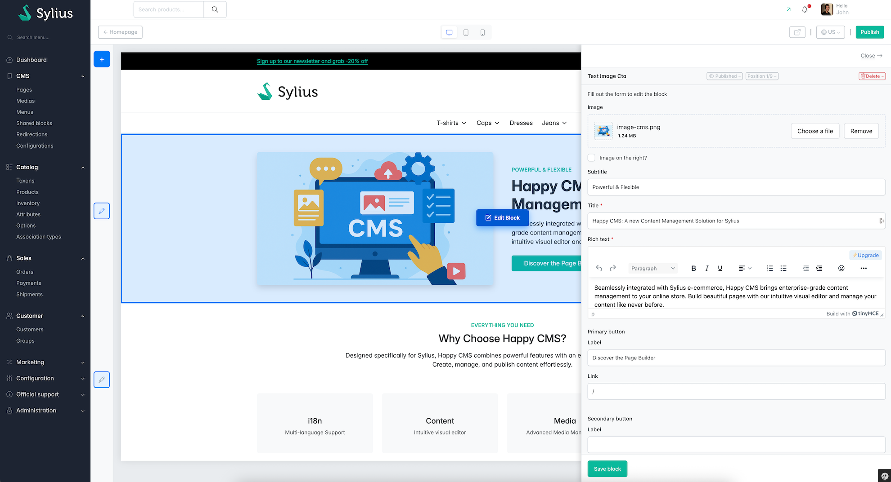
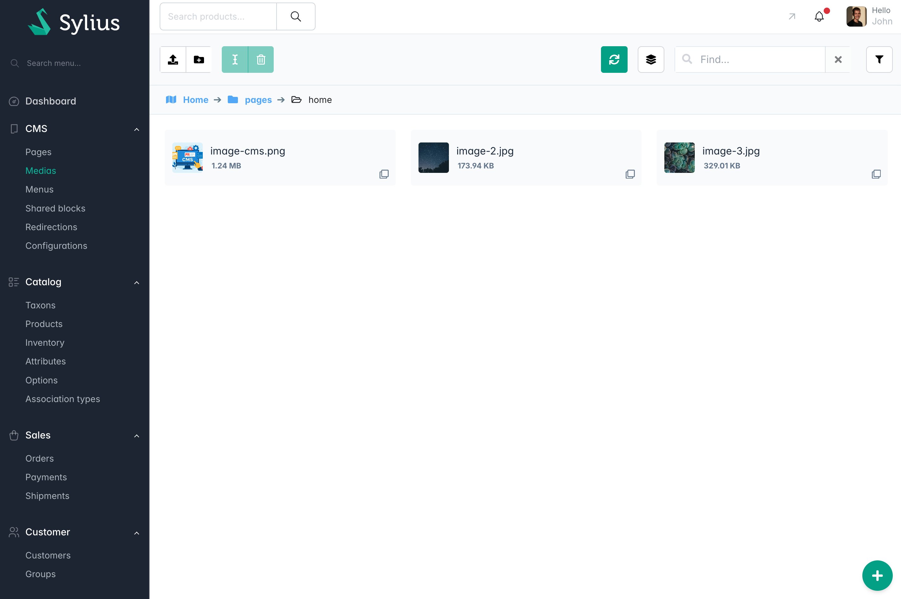

<div align="center">

# Sylius Happy CMS Plugin


</div>


<div align="center">

[Overview](#overview) • [Installation](#installation) • [Documentation](#documentation)

</div>

---

## Overview

Happy CMS is a simple Content Management System (CMS) plugin for Sylius that enables you to create and manage dynamic pages based on Sylius custom and routable resources. 

The plugin brings awesome CMS features to Sylius, including:
- **Page Builder**: A back-office visual interface for preview and managing pages content with various content blocks.
- **Media Management**: Organize and manage media files (images, videos, documents) used in your CMS pages. Compatible with CDN and cloud storage solutions.
- **SEO**: Built-in SEO management for optimizing your pages for search engines.
- **Multilingue**: Full support for multiple languages and locales.
- **Custom Routable Resource**: Define your own entities that can be routed and displayed as CMS pages.
- **Menu Management**: Create and manage menus for your site navigation.
- **Flexible Blocks**: Use default (or create custom) various types of content blocks (text, images, videos, etc.) within your pages.
- **Shared Blocks**: Reusable content blocks that can be used across multiple pages.
- **Helpers**:
    - Commands to generate entities, repositories and admin classes for your custom routable resources.
    - Commands to generate blocks easily.
- **AI**: Leverage AI to assist in generating content for your pages (requires API key).
- **CRUD**: Integrated with [Sylius Easy CRUD Plugin](https://github.com/agence-adeliom/sylius-easy-crud-plugin) for simplified CRUD management.
---

## Installation and documentation

1.  [Install this plugin](./docs/INSTALLATION.md)
2.  [Explore documentation](./README.md)

## Versions

| Plugin Version            | Sylius Version | New / Guide                 | Support |
|---------------------------|----------------|-----------------------------|---------|
| ^1.x                      | ^1.13          | Installation guide          | Beta    |
| ^2.0.0                    | ^2.0.0         | Migration guide from ^1.x   | Beta    |
| ^2.1.0 (new page builder) | \>= 2.0.0      | Migration guide from ^2.0.x | LTS     |

## Feature preview





## Installation

### 1. Install via Composer

```bash
composer require agence-adeliom/sylius-happy-cms-plugin --no-scripts
composer require --dev symfony/maker-bundle
```

### 2. Enable the Bundle

Add the plugin to `config/bundles.php`:

```php
<?php

return [
    // ...
    Adeliom\SyliusEasyCrudPlugin\SyliusEasyCrudPlugin::class => ['all' => true],
    Adeliom\SyliusHappyCMSPlugin\SyliusHappyCMSPlugin::class => ['all' => true],
   
    Symfony\Bundle\MakerBundle\MakerBundle::class => ['dev' => true, 'test' => true],
];
```

### 3. Import Configuration

In `config/packages/_sylius.yaml`:

```yaml
imports:
  - { resource: "@SyliusEasyCrudPlugin/config/config.yaml" }
  - { resource: "@SyliusHappyCMSPlugin/config/config.yaml" }
```

### 4. Import Routes

In `config/routes.yaml`:

```yaml
sylius_happy_cms:
  resource: "@SyliusHappyCMSPlugin/config/routes.yaml"
  
sylius_easy_crud:
  resource: "@SyliusEasyCrudPlugin/config/routes.yaml"
```

### 5. Configure your firewall to protect preview routes

All admin users with ROLE_ALLOWED_TO_SWITCH AND ROLE_HAPPY_CMS_CONTENT_BUILDER will be able to preview CMS routable entities.

In config/packages/security.yaml

```yaml 
security:
    firewalls:
        #... 
        admin_happy_cms_content_builder:
            switch_user: { role: ROLE_ALLOWED_TO_SWITCH }
            context: admin
            pattern: "%sylius.security.shop_regex%"
            request_matcher: Adeliom\SyliusHappyCMSPlugin\Security\PreviewRequestMatcher
            provider: sylius_admin_user_provider
    #... 
    role_hierarchy:
        ROLE_ADMINISTRATION_ACCESS: [ ROLE_HAPPY_CMS_CONTENT_BUILDER ]
```

### 5. Generate default files in your project (entities, repositories and admin classes) :

Actually, we don't have Symfony recipes, so we created a command to generate files automatically.

```bash
php bin/console make:happy-cms:install
```
This command will :
- Create all entities, repositories and admin class
- update config/routes.yaml by adding route properly declared
- update config/packages/sylius_resource.yaml by adding sylius routes properly declared
- update config/packages/sylius_happy_cms.yaml by adding new files properly declared

If something goes wrong, you can do those actions manually, check [detailed configuration](./docs/DETAILED_CONFIG.md).

### 6. Install Assets

```bash
php bin/console assets:install
```

### 7. Update database

```bash
php bin/console doc:mig:diff
php bin/console doc:mig:mig
php bin/console cache:clear
```

At this point, the plugin should be installed and ready to use!

---

## Documentation

- **[Configure Homepage](./docs/HOMEPAGE.md)**
- **[Create demo content](./docs/DEMO_CONTENT.md)**
- **[Create custom routable entities](./docs/CREATE_ROUTABLE_ENTITIES.md)**
- **[Create custom CMS blocks](./docs/CREATE_BLOCK.md)**
- **[Detailed default configuration](./docs/DETAILED_CONFIG.md)**
- **[How routing work](./docs/ROUTING.md)**

---

<div align="center">

**If this plugin helped you, please consider giving it a ⭐ on GitHub!**

Made with ❤️ by [Adeliom](https://www.adeliom.com/)


[](LICENSE)
[](https://php.net)
[](https://sylius.com)
[](https://packagist.org/packages/agence-adeliom/sylius-happy-cms-plugin)

</div>
