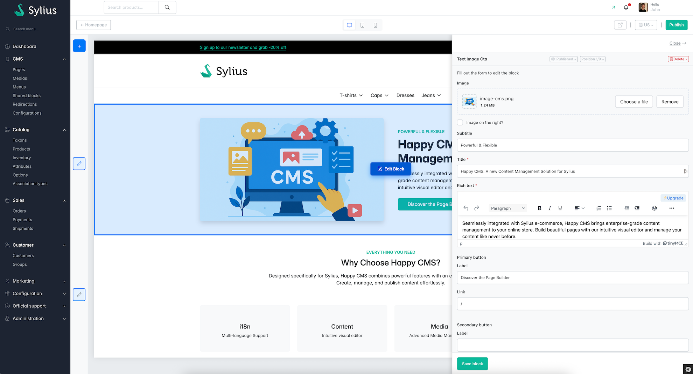
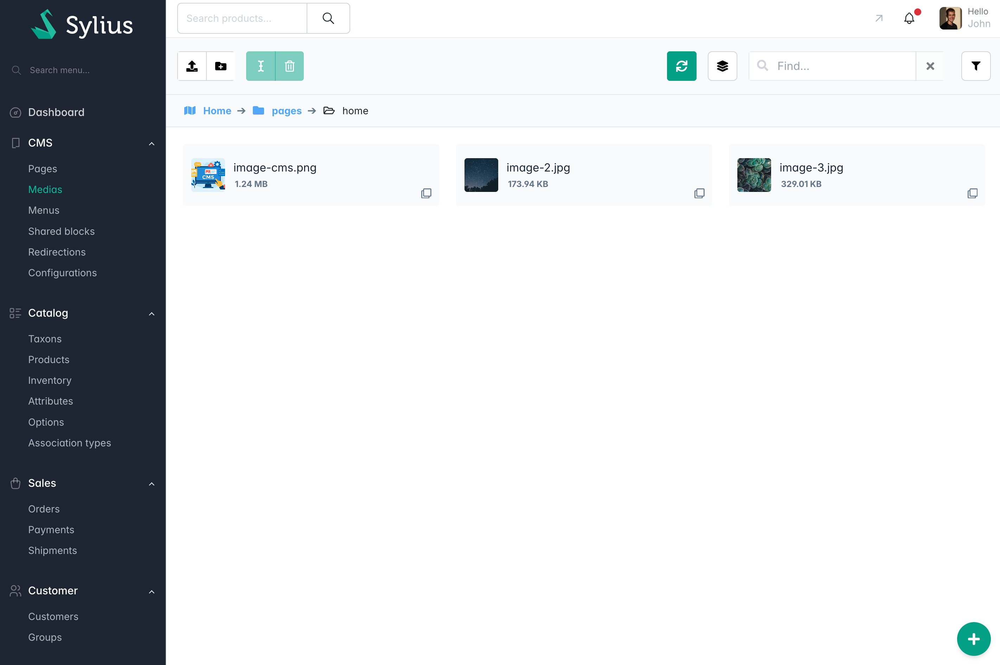

<div align="center">

# Sylius Happy CMS Plugin — CMS & Page Builder for Sylius

**Visual page builder in the Sylius admin, content blocks, media manager, menus, SEO and multilingual pages for Sylius 1.13 / 1.14 and Sylius 2.x.**

</div>


<div align="center">

[Overview](#overview) • [Versions](#versions) • [Installation](#installation) • [Documentation](#documentation)

</div>

---

## Overview

Happy CMS is a **CMS plugin for Sylius** with a **visual page builder in the back office (Sylius admin)**. Merchants and content editors build and edit pages from content blocks and see a live preview of the shop page, without writing code. Developers keep full control: pages are Sylius routable resources, blocks are Symfony form types and Twig templates.

It works with **Sylius 1.13, 1.14, 2.0, 2.1, 2.2 and 2.3**: each Sylius version has its own plugin branch (see [Versions](#versions)).

### Back-office page builder

- **Visual editor in the Sylius admin**: compose pages with flexible content blocks (text, WYSIWYG, image, gallery, CTA, accordion, key features…).
- **Live preview**: the real shop page is rendered next to the editor, in an iframe, while you edit.
- **Responsive preview**: switch between desktop, tablet and mobile resolutions.
- **Per-locale editing**: edit and preview every translation of a page.
- **Shared blocks**: reusable blocks (reassurance banner, footer CTA…) used across several pages.

### CMS features

- **Pages and custom routable resources**: create your own entities (blog, FAQ, brand pages, landing pages…) with their own URLs, routes, templates and logic.
- **Media Management**: organize images, videos and documents used in CMS pages, built on the Flysystem storage abstraction layer.
- **SEO**: meta title, meta description, robots, sitemap and URL management for every page.
- **Multilingual**: full support for Sylius locales and translated URLs.
- **Menu Management**: hierarchical menus for the shop navigation.
- **Custom blocks**: use the default blocks, override them, or create your own.
- **Developer helpers**: Maker commands to generate entities, repositories, admin CRUD and blocks.
- **AI**: AI assistant to help write page content (requires an API key).
- **CRUD**: integrated with [Sylius Easy CRUD Plugin](https://github.com/agence-adeliom/sylius-easy-crud-plugin) for simplified Sylius resource CRUD management.

---

## Installation and documentation

1.  [Pick the plugin version matching your Sylius version](#versions)
2.  [Install this plugin](#installation)
3.  [Explore documentation](#documentation)

## Versions

> **The plugin supports Sylius 1.x and every Sylius 2.x minor release, not only Sylius 2.3.**
> The `2.3.x` branch (the one you are probably reading) targets Sylius 2.3 only. Older Sylius versions are supported by older plugin versions, each maintained on its own Git branch with its own README.

Pick the line matching the Sylius version of your project. Running `composer require agence-adeliom/sylius-happy-cms-plugin` without a constraint also lets Composer select the compatible version.

| Your Sylius version | Plugin version | Composer constraint | Git branch | PHP           | Symfony  | Maintained | Installation guide                                                                                                             |
|---------------------|----------------|---------------------|------------|---------------|----------|------------|--------------------------------------------------------------------------------------------------------------------------------|
| 2.3                 | 2.3.x          | `^2.3`              | [`2.3.x`](https://github.com/agence-adeliom/sylius-happy-cms-plugin/tree/2.3.x) | 8.4, 8.5      | 7.4, 8.x | Yes        | [This README](#installation)                                                                                                   |
| 2.1, 2.2            | 2.1.x          | `~2.1.0`            | [`2.1.x`](https://github.com/agence-adeliom/sylius-happy-cms-plugin/tree/2.1.x) | 8.3, 8.4, 8.5 | 7.4      | Yes        | [2.1.x README](https://github.com/agence-adeliom/sylius-happy-cms-plugin/tree/2.1.x?tab=readme-ov-file#installation)          |
| 2.0                 | 2.0.x          | `~2.0.0`            | [`2.0.x`](https://github.com/agence-adeliom/sylius-happy-cms-plugin/tree/2.0.x) | 8.2, 8.3, 8.4 | 6.4, 7.x | No         | [2.0.x README](https://github.com/agence-adeliom/sylius-happy-cms-plugin/tree/2.0.x?tab=readme-ov-file#installation)          |
| 1.13, 1.14          | 1.14.x         | `^1.14`             | [`1.x`](https://github.com/agence-adeliom/sylius-happy-cms-plugin/tree/1.x)     | 8.2, 8.3, 8.4 | 6.4, 7.x | No         | [v1.14.12 README](https://github.com/agence-adeliom/sylius-happy-cms-plugin/tree/v1.14.12?tab=readme-ov-file#installation)    |

### Upgrading between versions

- **Sylius 1.x → Sylius 2.0** (plugin 1.14 → 2.0, BC break): [Sylius 2 migration guide](./docs/migration/SYLIUS_2.md).
- **Plugin 2.0 → 2.1** (new content model persistence and new page builder, BC break): [content block migration guide](./docs/migration/CONTENT_BLOCK.md).
- **Plugin 2.1 → 2.3** (Sylius 2.3 / Symfony 8 support): upgrade Sylius to 2.3, then require `agence-adeliom/sylius-happy-cms-plugin:^2.3`.

## Feature preview





## Installation

These steps install the **2.3.x** version (Sylius 2.3). For another Sylius version, follow the installation guide linked in the [Versions](#versions) table.

### 1. Install via Composer

```bash
composer require agence-adeliom/sylius-happy-cms-plugin --no-scripts
composer require --dev symfony/maker-bundle --no-scripts
```

### 2. Enable the Bundle

Add the plugin to `config/bundles.php`:

```php
<?php

return [
    // ...
    Adeliom\SyliusEasyCrudPlugin\SyliusEasyCrudPlugin::class => ['all' => true],
    Adeliom\SyliusHappyCMSPlugin\SyliusHappyCMSPlugin::class => ['all' => true],
   
    Symfony\Bundle\MakerBundle\MakerBundle::class => ['dev' => true, 'test' => true],
];
```

### 3. Import Configuration

In `config/packages/_sylius.yaml`:

```yaml
imports:
  - { resource: "@SyliusEasyCrudPlugin/config/config.yaml" }
  - { resource: "@SyliusHappyCMSPlugin/config/config.yaml" }
```

### 4. Import Routes

In `config/routes.yaml`:

```yaml
sylius_happy_cms:
  resource: "@SyliusHappyCMSPlugin/config/routes.yaml"
  
sylius_easy_crud:
  resource: "@SyliusEasyCrudPlugin/config/routes.yaml"
```

### 5. Configure your firewall to protect preview routes

All admin users with ROLE_ALLOWED_TO_SWITCH AND ROLE_HAPPY_CMS_CONTENT_BUILDER will be able to preview CMS routable entities.

In config/packages/security.yaml

```yaml 
security:
    firewalls:
        #... 
        admin_happy_cms_content_builder:
            switch_user: { role: ROLE_ALLOWED_TO_SWITCH }
            context: admin
            pattern: "%sylius.security.shop_regex%"
            request_matcher: Adeliom\SyliusHappyCMSPlugin\Security\PreviewRequestMatcher
            provider: sylius_admin_user_provider
    #... 
    role_hierarchy:
        ROLE_ADMINISTRATION_ACCESS: [ ROLE_HAPPY_CMS_CONTENT_BUILDER ]
```

### 5.1 Allow the page builder iframes (X-Frame-Options)

The page builder displays admin **and front** pages (preview) inside iframes, so every response must allow same-origin framing.
Send a single `X-Frame-Options: SAMEORIGIN` header, from one source only:

- If you use [NelmioSecurityBundle](https://github.com/nelmio/NelmioSecurityBundle), use `SAMEORIGIN`, not `DENY`, on the whole site:

  ```yaml
  # config/packages/nelmio_security.yaml
  nelmio_security:
      clickjacking:
          paths:
              '^/.*': SAMEORIGIN
  ```

  and remove the Sylius subscriber, which also sets this header on every response (`src/Kernel.php`):

  ```php
  final class Kernel extends BaseKernel implements CompilerPassInterface
  {
      use MicroKernelTrait;

      public function process(ContainerBuilder $container): void
      {
          $container->removeDefinition('sylius.event_subscriber.x_frame_options');
      }
  }
  ```

- Remove `Header set X-Frame-Options SAMEORIGIN` from `public/.htaccess` (Sylius recipe, Apache) and do not set the header in the web server (Caddyfile, nginx) or the ingress either.
- Serve the admin and the shop on the same host, otherwise `SAMEORIGIN` blocks the preview (use CSP `frame-ancestors` in that case).

Two conflicting headers (`DENY, SAMEORIGIN`) make the browser fall back to `DENY`, and the page builder breaks with:

```
Refused to display '…' in a frame because it set multiple 'X-Frame-Options' headers with conflicting values ('DENY, SAMEORIGIN'). Falling back to 'deny'.
page-builder.js: Uncaught SecurityError: Failed to read a named property 'href' from 'Location': Blocked a frame with origin "…" from accessing a cross-origin frame.
```

Check with `curl -skI https://your-shop.local/en_US/ | grep -i x-frame-options`: exactly one `SAMEORIGIN` line is expected.

### 5. Generate default files in your project (entities, repositories and admin classes) :

Actually, we don't have Symfony recipes, so we created a command to generate files automatically.

```bash
php bin/console make:happy-cms:install
```
This command will :
- Create all entities, repositories and admin class
- update config/routes.yaml by adding route properly declared
- update config/packages/sylius_resource.yaml by adding sylius routes properly declared
- update config/packages/sylius_happy_cms.yaml by adding new files properly declared

If something goes wrong, you can do those actions manually, check [detailed configuration](./docs/DETAILED_CONFIG.md).

### 6. Install Assets

```bash
php bin/console assets:install
```

### 7. Update database

```bash
php bin/console doc:mig:diff
php bin/console doc:mig:mig
php bin/console cache:clear
# To compile our symfony UX components, you need to re run npm install and npm run build in the root of your project
npm install
npm run build
```

### 8. (Optional) Configure AI Development Guides

If you're using AI assistants (like Claude Code, GitHub Copilot, or Cursor), configure them to use the plugin's specialized guides:

#### For Claude Code users:

Create or update `CLAUDE.md` in your project root:

```markdown
# Project Instructions

[Your existing project instructions...]

## Sylius Happy CMS Plugin

This project uses [Sylius Happy CMS Plugin](https://github.com/agence-adeliom/sylius-happy-cms-plugin) for content management.

### AI Development Guides

Import the AI development guides for efficient development:

- **Happy CMS development guides**: `vendor/agence-adeliom/sylius-happy-cms-plugin/docs/agents/CLAUDE.md`
```

#### For other AI assistants:

Create or update `.cursorrules`, `AGENTS.md`, or your AI configuration file with similar content pointing to the guides in `vendor/agence-adeliom/sylius-happy-cms-plugin/docs/agents/`.

Add "See @CLAUDE.md"

---

## Documentation

- **[Override default Sylius homepage](./docs/homepage.md)**
- **[Routing](./docs/routing.md)**
- **[Seo](./docs/seo.md)**
- **[Medias](./docs/medias.md)**
- **[Blocks](./docs/blocks.md)**
- **[Menu](./docs/menu.md)**
- **[AI](./docs/ai.md)**
- **[Full plugin configuration](./docs/configuration.md)**
- **[Contribution](./docs/contribution.md)**

Start by read the documentation, then you can : 
- Use bundles commands to create new routable resources (blog, faq, brand pages, etc.) [see here](./docs/commands/generate-cms-model.md)
- Use bundle commands to create new content blocks (flex or shared)

---

<div align="center">

**If this plugin helped you, please consider giving it a ⭐ on GitHub!**

Made with ❤️ by [Adeliom](https://www.adeliom.com/)


[](LICENSE)
[](https://php.net)
[](https://sylius.com)
[](https://packagist.org/packages/agence-adeliom/sylius-happy-cms-plugin)

</div>
