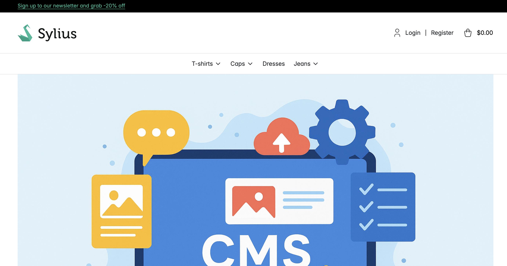

To add some demo content, you can run the following commands after setting up the application:

```bash
bin/console happycms:starter:create-demo-pages
bin/console happycms:starter:create-demo-menu
```



